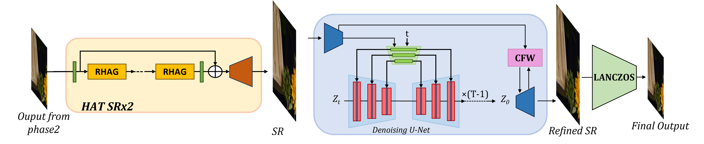

# NTIRE2024-RAIM-IIP_IR-Phase3

The code repository for the phase three of Restore Any Image Model (RAIM) in the Wild: An NTIRE Challenge in Conjunction with CVPR 2024


## Team: **IIP_IR**

## How to run?

### Dataset

Please place the phase 3 test data under the `inputs` folder. 

```
inputs/
    └── PhaseThreeData
          └── 001.png # LQ images
          └── ...
          └── 050.png
```

### Pretrained Model

The pretrained model can be downloaded from [Google Drive](https://drive.google.com/drive/folders/1PXUcAulPg7Q5r9-0nndeYPqTmMryaXRa?usp=drive_link), and put it under folder `pretrained`. As shown in the following picture:
```
pretrained/
    └── hat_model.pth
    └── kernel_model.pth
    └── open_clip_pytorch_model.bin
    └── restore_model.pth
    └── stablesr_turbo.ckpt
    └── vqgan_cfw_00011.ckpt
```


### Preprocess

``` shell
# git clone this repository
git clone https://github.com/gorgeousmwz/NTIRE2024-RAIM-IIP_IR-Phase3.git

# Create a conda environment and activate it
cd NTIRE2024-RAIM-IIP_IR-Phase3/HAT
conda create -n iip_ir python=3.9
conda activate iip_ir
pip install -r requirements.txt
python setup.py develop

# run preprocess command
cd ..
sh inference_preprocess.sh
```

### Inference


``` shell
cd StableSR

# Create a conda environment and activate it
conda env create --file environment.yaml
conda activate stablesr

# Install xformers
conda install xformers -c xformers/label/dev

# Install taming & clip
pip install -e git+https://github.com/CompVis/taming-transformers.git@master#egg=taming-transformers
pip install -e git+https://github.com/openai/CLIP.git@main#egg=clip
pip install -e .

# inference to final result
cd ..
sh inference_stablesr.sh
```


## General method description of phase 2. 


We have introduced an integrated framework for image restoration. As shown in Fig 1, the framework comprises two main components. The first component is a Blur Kernel Estimation module(BKE), designed to estimate the blur kernel of LQ images. This U-Net shape module generates a $K\times K$ blur kernel for each pixel. Subsequently, these blur kernels are utilized to produce reblur LQ images based on the paired HQ images, thereby enabling supervised training for the U-Net model.

The second component is the restoration module. It is also designed using a U-Net architecture consisting of 3 layers. Each layer is connected by a SPADE block. The feature map before Downsample will be processed by the SPADE block, and then combined with the feature map after Upsample at the same layer. Additionally, the blur kernel estimated by BKE will also be embedded into the SPADE block at the middle of U-Net. 

## General method description of phase 2. 



Above figure illustrates the pipeline of phase3. We utilize the pre-trained models to refine the details of the preprocessed images from phase2. The images first undergo x2 upscaling using Hybrid Attention Transformer (HAT) to enrich the textures. The initial upscaling phase effectively mitigates distortions of small-scale details such as texts during texture generation process leveraging pre-trained diffusion priors. We employ StableSR with SD-Turbo, which is a distilled version of Stable Diffusion using Adversarial Diffusion Distillation, to further refine the upscaled images, producing realistic textures in regions with severe degradations. The refined images are generated with 4 sampling steps and then downscaled with LANCZOS interpolation to obtain the final output.


## Contact
If you have any questions, please feel free to reach me out at `mawenzhuogorgeous@gmail.com`.

